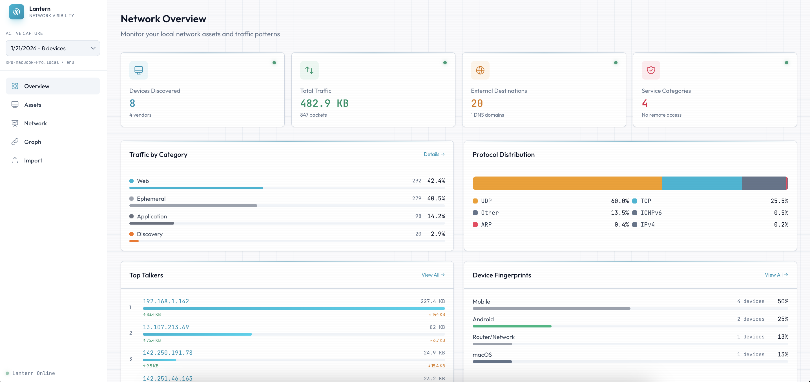
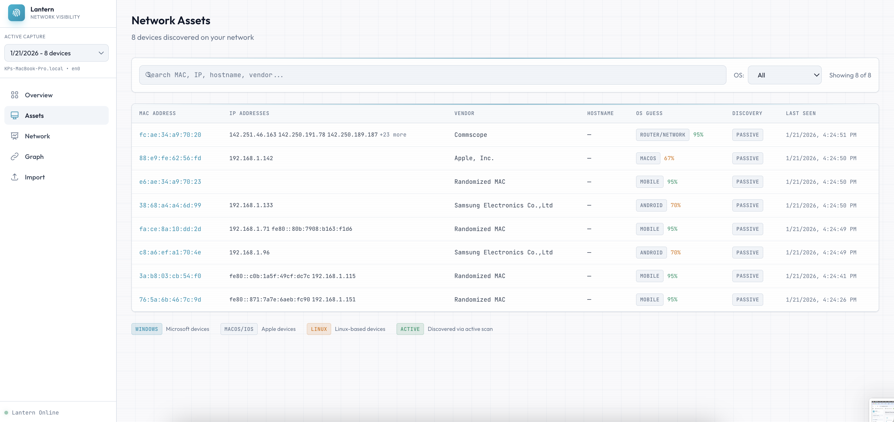
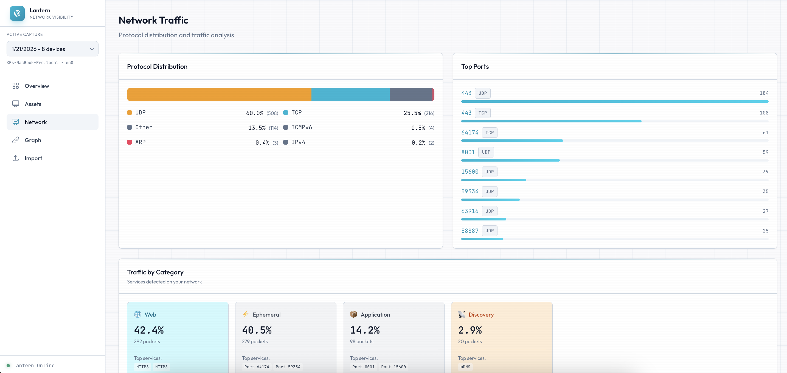
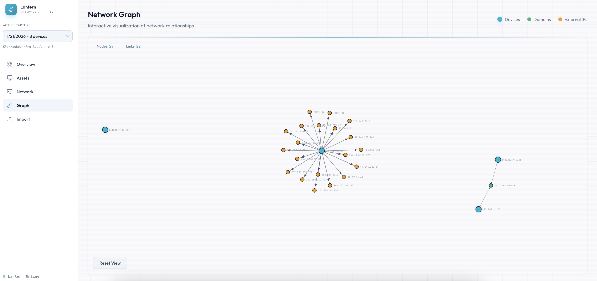

#  Lantern

Shine a light on your local network. Discover devices, fingerprint operating systems, and analyze traffic patterns.

## Components

### Lantern CLI (`sensor/`)
Passive network monitoring tool that captures and analyzes local network traffic.

**Features:**
- Packet capture using libpcap/gopacket
- Device discovery (passive ARP/DHCP + optional active ARP sweep)
- OS fingerprinting via protocol signals:
  - mDNS (Apple devices) - 90% confidence
  - LLMNR/NBNS (Windows devices) - 80-85% confidence
  - TTL analysis - 30% confidence
- MAC vendor lookup (OUI database)
- Traffic analysis (protocols, ports, DNS queries, destinations)
- JSON summary output

### Next.js Dashboard (`dashboard/`)
Modern dark-mode web interface for visualizing network data.

**Features:**
- Overview with stats cards
- Device table with filtering by vendor/OS
- Traffic analysis (protocol distribution, top ports, top talkers)
- DNS domain queries
- D3.js force-directed network graph
- File import for Lantern summaries
- SQLite persistence via sql.js

## Quick Start

### Prerequisites
- Go 1.21+
- Node.js 18+
- libpcap (macOS: built-in, Linux: `apt install libpcap-dev`)

### Build & Run Lantern
```bash
cd sensor
go build -o lantern ./cmd/sensor

# Capture for 30 seconds (requires sudo for packet capture)
sudo ./lantern --duration 30 --output ./captures

# Options
./lantern --help
./lantern --list-ifaces          # List network interfaces
./lantern --iface en0            # Specify interface
./lantern --active               # Enable active discovery (ARP sweep)
```

### Run Dashboard
```bash
cd dashboard
npm install
npm run dev
# Open http://localhost:3000
```

### Import Data
1. Run Lantern to generate a `summary_*.json` file
2. Open the dashboard and go to Import
3. Drag and drop the JSON file
4. View devices, traffic, and network graph

## Project Structure

```
├── sensor/
│   ├── cmd/sensor/main.go       # CLI entry point
│   ├── internal/
│   │   ├── capture/             # Packet capture engine
│   │   ├── discovery/           # Device discovery (passive/active)
│   │   ├── fingerprint/         # OS fingerprinting
│   │   ├── iface/               # Interface selection
│   │   ├── oui/                 # MAC vendor lookup
│   │   ├── output/              # JSON summary generation
│   │   ├── platform/            # OS-specific detection
│   │   └── traffic/             # Traffic analysis
│   └── pkg/consent/             # First-run authorization
│
├── dashboard/
│   ├── src/app/
│   │   ├── page.tsx             # Home/overview
│   │   ├── assets/              # Device table
│   │   ├── network/             # Traffic analysis
│   │   ├── graph/               # D3 network graph
│   │   ├── import/              # File upload
│   │   └── api/                 # REST endpoints
│   └── src/lib/db/              # SQLite client
```

## Privacy & Safety

- **First-run consent**: Authorization prompt before capturing
- **Metadata only**: No packet payloads stored by default
- **Confidence labels**: All OS guesses show confidence scores and signals used
- **Discovery labels**: Passive vs active discovery clearly marked
- **Local only**: Data stays on your machine

## Screenshots

### Network Overview
Dashboard home with traffic categories, protocol distribution, top talkers, and device fingerprints.



### Network Assets
Device inventory with MAC addresses, IPs, vendors, OS fingerprints, and discovery sources.



### Network Traffic
Protocol breakdown, top ports, and traffic categorization by service type.



### Network Graph
Interactive D3.js force-directed graph showing device relationships and external connections.



## License

MIT
